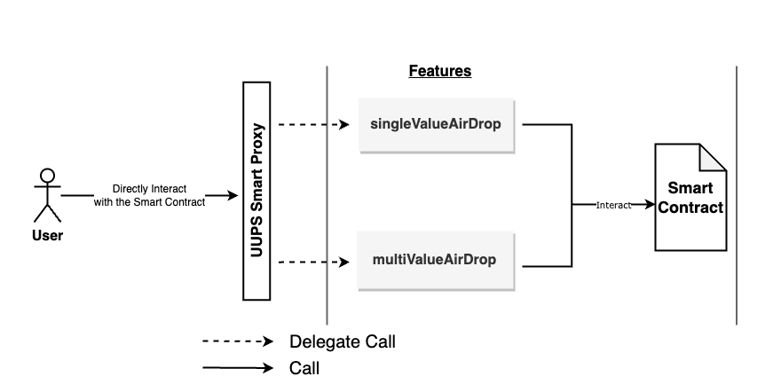

FutureDrop
=====

An utility smart contract to Airdrop ERC20 / BEP20 Tokens to specified address for the specified amount.

Architecture
=====


Deploying the Smart Contracts
======
The deployment script is written in the migrations file `1_initial_migration.js`. This project has a single contract which is deployed using **OpenZeppelin** Upgradeable proxy. 

Step 1 - Importing the Contracts
--- 
```javascript
const AirDropper = artifacts.require("AirDropper");
```

Step 2 - Get Account for Deployemt
--- 
```javascript
const accounts = await web3.eth.getAccounts();
```

Step 3 - Deploys AirDropper contract using openzeppelin upgradable plugin. 
--- 
The value `10` specifies the limit of the AirDropper smart contract.

```javascript
let airDropper = await deployProxy(AirDropper, [10], { kind: 'uups' });
```

Run Migrate to deploy the contract.
-----
`truffle migrate`

<br>
